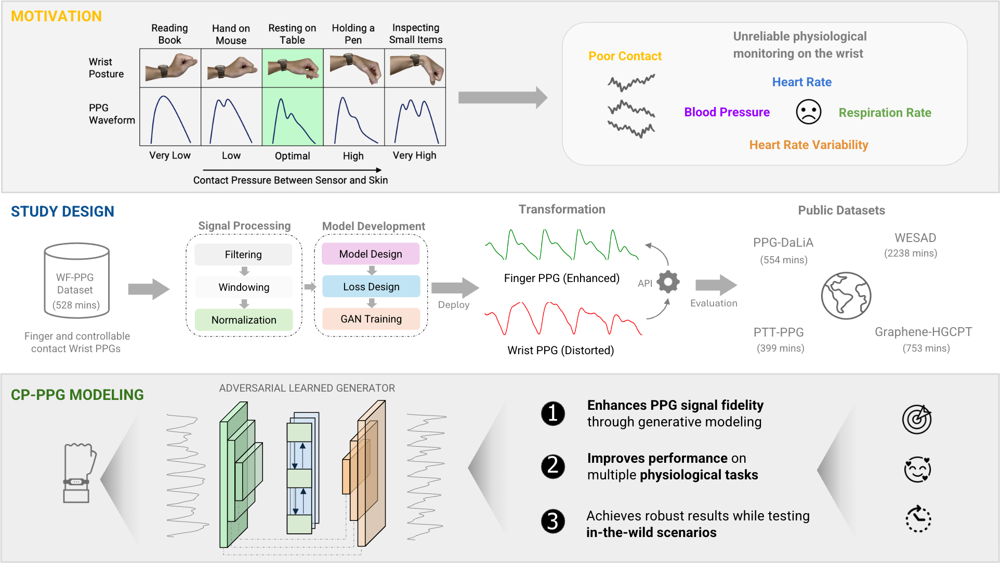

Reliable Wrist PPG Monitoring by Mitigating Poor Skin Sensor Contact
=====

<a href="#">Hung Manh Pham</a>1,
<a href="#">Matthew Yiwen Ho</a>1,
<a href="#">Yiming Zhang</a>1,
<a href="https://www.cl.cam.ac.uk/~ds806/">Dimitris Spathis</a>2,3,
<a href="https://aqibsaeed.github.io/">Aaqib Saeed</a>4,
<a href="https://www.dongma.info/">Dong Ma</a>1,2*

1School of Computing and Information Systems, Singapore Management University, Singapore  
2Department of Computer Science and Technology, University of Cambridge, UK  
3Google, UK  
4Department of Industrial Design, Eindhoven University of Technology, The Netherlands  
 

# Introduction

Photoplethysmography (PPG) is a widely used non-invasive technique for monitoring cardiovascular health and various physiological parameters on consumer and medical devices. While motion artifacts are well-known challenges in dynamic settings, suboptimal skin-sensor contact in sedentary conditions - an important issue often overlooked in existing literature - can distort PPG signal morphology, leading to the loss or shift of essential waveform features and therefore degrading sensing performance. In this work, we propose a deep learning-based framework that transforms contact pressure-distorted PPG signals into ones with the ideal morphology, known as CP-PPG. CP-PPG incorporates a well-crafted data processing pipeline and an adversarially trained deep generative model, together with a custom PPG-aware loss function. We validated CP-PPG through comprehensive evaluations, including 1) morphology transformation performance, 2) downstream physiological monitoring performance on public datasets, and 3) in-the-wild performance, which together demonstrate substantial and consistent improvements in signal fidelity.

# Acknowledgements

This research was supported by the Singapore Ministry of Education (MOE) Academic Research Fund (AcRF) Tier 2 grant (Grant ID: T2EP20124-0046).
