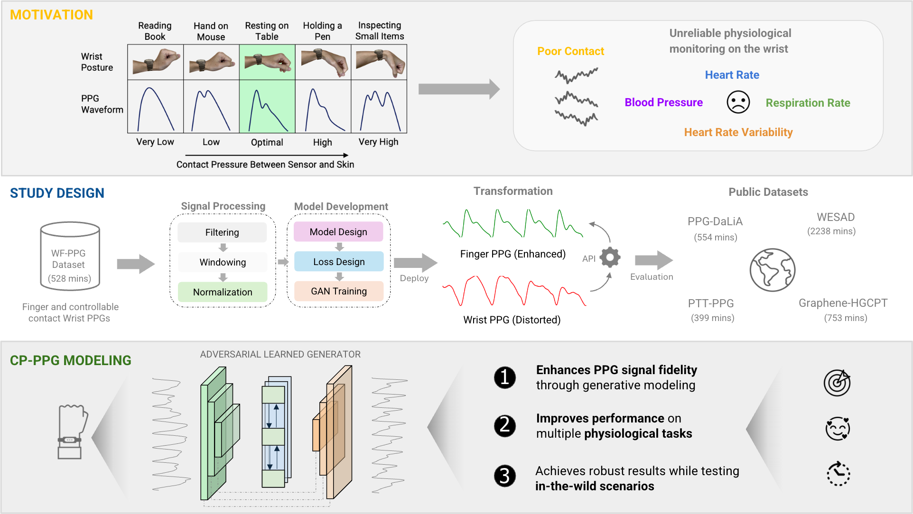

Reliable Wrist PPG Monitoring by Mitigating Poor Skin Sensor Contact
=====

<a href="">Hung Manh Pham</a><sup>1</sup>,
<a href="">Matthew Yiwen Ho</a><sup>1</sup>,
<a href="">Yiming Zhang</a><sup>1</sup>,
<a href="https://www.cl.cam.ac.uk/~ds806/">Dimitris Spathis</a><sup>2,3</sup>,
<a href="https://aqibsaeed.github.io/">Aaqib Saeed</a><sup>4</sup>,
<a href="https://www.dongma.info/">Dong Ma</a><sup>1,2*</sup>

<sup>1</sup>School of Computing and Information Systems, Singapore Management University, Singapore  
<sup>2</sup>Department of Computer Science and Technology, University of Cambridge, UK  
<sup>3</sup>Google, UK  
<sup>4</sup>Department of Industrial Design, Eindhoven University of Technology, The Netherlands  
<br>

[](https://www.nature.com/articles/s41598-025-31883-5)
[](https://huggingface.co/Manhph2211/CP-PPG)

# Introduction



Photoplethysmography (PPG) is a widely used non-invasive technique for monitoring cardiovascular health and various physiological parameters on consumer and medical devices. While motion artifacts are well-known challenges in dynamic settings, suboptimal skin-sensor contact in sedentary conditions - an important issue often overlooked in existing literature - can distort PPG signal morphology, leading to the loss or shift of essential waveform features and therefore degrading sensing performance. In this work, we propose a deep learning-based framework that transforms contact pressure-distorted PPG signals into ones with the ideal morphology, known as CP-PPG. CP-PPG incorporates a well-crafted data processing pipeline and an adversarially trained deep generative model, together with a custom PPG-aware loss function. We validated CP-PPG through comprehensive evaluations, including 1) morphology transformation performance, 2) downstream physiological monitoring performance on public datasets, and 3) in-the-wild performance, which together demonstrate substantial and consistent improvements in signal fidelity.


# Project Structure

```
CP-PPG/
├── configs/
│   ├── config.yml                  # Main configuration file
│   └── seed.py                     # Reproducibility settings (seed=42)
├── src/
│   ├── models/
│   │   ├── cpppg.py                # Generator and Discriminator architectures
│   │   └── model_utils.py          # PPG blocks (Gated CNN, SE block, etc.)
│   ├── trainer/
│   │   ├── engine.py               # Standard training loop
│   │   └── adverarial_engine.py    # Adversarial (GAN) training loop
│   ├── dataloader/
│   │   └── dataset.py              # PPGDataset and data loaders
│   ├── metrics/
│   │   ├── losses.py               # Custom PPG-aware loss, Hinge loss, GenLoss
│   │   └── metrics.py              # Signal comparison metrics
│   ├── utils/
│   │   ├── utils.py                # General utilities, config loading, plotting
│   │   ├── preprocess.py           # Signal processing (filtering, windowing)
│   │   ├── prepare.py              # Data handler for train/val/test splits
│   │   ├── enrichment.py           # Data augmentation transforms
│   │   ├── feature.py              # PPG feature extraction
│   │   └── classification.py       # Waveform classification utilities
│   └── experiments/
│       └── tools/
│           ├── train.py            # Training entry point
│           ├── test.py             # Inference and evaluation
│           └── deploy.py           # Flask API server
├── pipeline.ipynb                  # End-to-end walkthrough notebook
├── Dockerfile                      # Container deployment
├── requirements.txt                # Python dependencies
└── checkpoints/                    # Saved model weights
```

# Installation

```bash
conda create -n ppg python=3.11
conda activate ppg
pip install -r requirements.txt
```

# Data Preparation

We use the **WF-PPG** dataset introduced in [WF-PPG](https://springernature.figshare.com/articles/dataset/WF-PPG_A_Wrist-finger_Dual-Channel_Dataset_for_Studying_the_Impact_of_Contact_Pressure_on_PPG_Morphology/27011998?file=50956401). This contains simultaneous recordings of distorted (input) and ideal (reference) wrist PPG signals across multiple subjects under varying skin-sensor contact pressures. Download and place the preprocessed data in json format under `data/`.

```json
{
  "<subject_id>.csv": {
    "in_windows":  [[float, ...], ...],
    "ref_windows": [[float, ...], ...],
  },
  ...
}
```

# Training

### Experiment Tracking (Optional)

CP-PPG uses [Comet ML](https://www.comet.com/) for experiment tracking. To enable it:
1. Create a Comet account and get your API key.
2. Save the key to `configs/experiment_apikey.txt`.

### Run Training

```bash
python src/experiments/tools/train.py
```

Note that the training supports different settings controlled by `configs/config.yml`. Subsequently, a pre-trained CP-PPG checkpoint can be found [here](https://huggingface.co/Manhph2211/CP-PPG).

# Testing

Run inference on a test set and print quantitative metrics:

```bash
python src/experiments/tools/test.py
```

This evaluates the trained model on the test set, comparing the enhanced CP-PPG signals to the ideal morphology using metrics such as MSE, Pearson correlation, and a custom PPG similarity score.

# Deployment

### Flask API

```bash
python src/experiments/tools/deploy.py
```

This starts a Flask server on port `8080` with the following endpoints:

| Endpoint | Method | Description |
|----------|--------|-------------|
| `/enhance` | POST | Transforms a distorted PPG signal into ideal morphology |
| `/preprocess` | POST | Normalizes a raw PPG signal |

**Docker**

```bash
docker build -t cpppg .
docker run -p 8080:8080 cpppg
```

# Notebook

For a step-by-step walkthrough covering data exploration, augmentation, model definition, training, and deployment, see `pipeline.ipynb`.

# Citation

```bibtex

@article{pham2025reliable,
  title={Reliable wrist PPG monitoring by mitigating poor skin sensor contact},
  author={Pham, Hung Manh and Ho, Matthew Yiwen and Zhang, Yiming and Spathis, Dimitris and Saeed, Aaqib and Ma, Dong},
  journal={Scientific Reports},
  year={2025},
  publisher={Nature Publishing Group UK London}
}

@article{ho2025wf,
  title={WF-PPG: A wrist-finger dual-channel dataset for studying the impact of contact pressure on PPG morphology},
  author={Ho, Matthew Yiwen and Pham, Hung Manh and Saeed, Aaqib and Ma, Dong},
  journal={Scientific Data},
  volume={12},
  number={1},
  pages={200},
  year={2025},
  publisher={Nature Publishing Group UK London}
}

```

# Acknowledgements

This research was supported by the Singapore Ministry of Education (MOE) Academic Research Fund (AcRF) Tier 2 grant (Grant ID: T2EP20124-0046).
